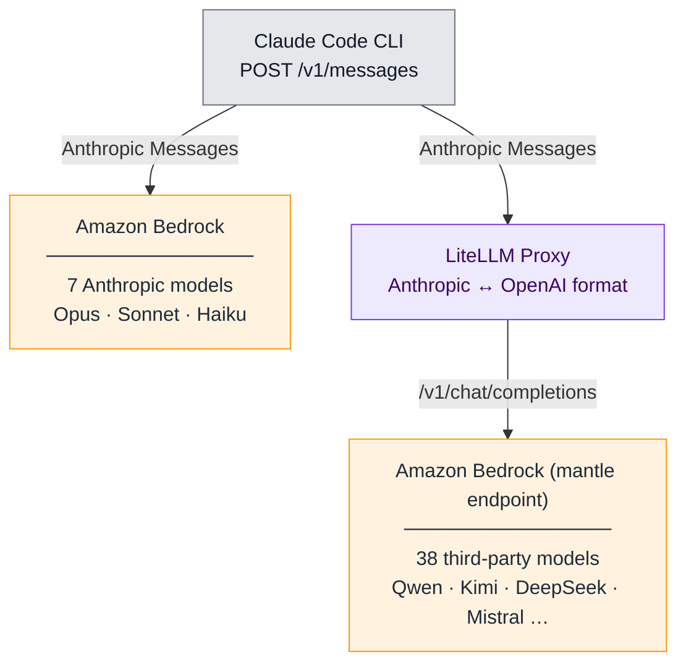
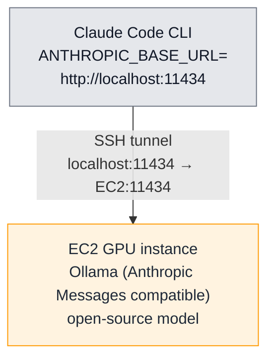

# Claude Code Multi-Model

[](LICENSE)
[](https://docs.aws.amazon.com/bedrock/latest/userguide/models-endpoint-availability.html)
[](./)

> **This is sample code intended for demonstration and learning purposes only.**
> It is not meant for production use. Review and harden all scripts, configurations,
> and IAM permissions before using in any production or sensitive environment.

## Overview

This repository does **two** things, in this order:

1. **Run [Claude Code](https://docs.anthropic.com/en/docs/claude-code) against
   non-Anthropic models.** Claude Code is Anthropic's command-line coding agent;
   by default it talks only to Anthropic's own models. Here it's wired up to
   any of 45 foundation models on Amazon Bedrock (Qwen, DeepSeek, Kimi, MiniMax,
   Mistral, GPT-OSS, GLM, Gemma, Nemotron, Palmyra, plus the 7 native Anthropic
   models), or to any open-source model you self-host on an EC2 GPU instance.
2. **Measure how well each of those models actually does coding work.** Once you
   can swap models freely, the next question is: which model is good enough for
   which task? The repo ships two complementary evaluation modes — the
   **`/swe` skill**, a per-task Software Engineering benchmark you point at any
   GitHub repo (5 tasks × 5 models already populated for `mcp-gateway-registry`,
   GPT-judged), and the **HumanEval benchmark**, a single-function `pass@1`
   suite with published cross-model results.

The first half is plumbing; the second is what makes the plumbing decision-grade.

### How it runs Claude Code on non-Anthropic models

Without modifying Claude Code. Claude Code speaks the Anthropic Messages API,
but most other models speak the OpenAI Chat Completions API. The repo bridges
that gap in two different ways depending on where the model lives.

**Path 1 — Amazon Bedrock (managed, pay-per-token).** Claude Code points at a
local [LiteLLM](https://github.com/BerriAI/litellm) proxy that translates
Anthropic Messages requests to OpenAI Chat Completions and forwards them to
Bedrock's [`bedrock-mantle` endpoint](https://docs.aws.amazon.com/bedrock/latest/userguide/inference.html).
Native Anthropic models on Bedrock skip the proxy and go direct. Best for model
variety with zero infrastructure to manage.

**Path 2 — Self-hosted on EC2 (your VPC, fixed GPU cost).** Claude Code points
at an [Ollama](https://ollama.com/) server running on an EC2 GPU instance, reached
through an SSH tunnel that forwards `localhost:11434` to the EC2 instance. Ollama
accepts Anthropic-Messages requests natively, so no proxy or format translation is
needed — the SSH tunnel itself is the entire "bridge." No public ingress, no API
keys on the wire. Best for data sovereignty (tokens never leave your AWS account),
air-gapped or compliance-sensitive environments, and high-volume workloads where
the fixed hourly GPU cost beats per-token Bedrock pricing.

The two paths share the same `/swe` and HumanEval evaluation harnesses, so quality
and cost numbers are directly comparable. They differ only in where the model
runs and how Claude Code reaches it.

| Path | Models | Cost Model | Best For |
|------|--------|------------|----------|
| [**Bedrock**](bedrock/) | 45 models from 11 providers | Pay-per-token | Model variety, zero infrastructure |
| [**Self-Hosted (EC2)**](self-hosted/) | Any Ollama/vLLM model | Fixed hourly GPU cost | Data sovereignty, air-gapped, unlimited tokens |

### How it measures the models

Two evaluation modes ship with the repo. Pick the one that matches the question
you're trying to answer:

| Mode | What it measures | Where the work lives |
|------|------------------|----------------------|
| **[SWE skill](#evaluation-1--swe-skill-real-world-tasks)** (real-world tasks) | Can the model take a real software-engineering problem in a real repo from idea to a complete design package — GitHub issue spec, low-level design, expert review, testing plan? | [.claude/skills/swe/](.claude/skills/swe/) → produces artifacts under [benchmarks/swe-benchmark-data/](benchmarks/swe-benchmark-data/) |
| **[HumanEval](#evaluation-2--humaneval-single-function-pass1)** (single-function pass@1) | On 164 small self-contained Python tasks, does the model emit a function body that passes the hidden unit tests? | [bedrock/benchmark/humaneval_runner.py](bedrock/benchmark/humaneval_runner.py) |

> **"SWE" here means software engineering in general — not [SWE-bench](https://www.swebench.com/),
> the specific benchmark dataset.** The skill in this repo lets you run any model
> against any task in any repo of your choosing. It is a *harness*, not a fixed
> benchmark set. Compare results across models on the same task, or compare a
> single model across tasks of varying difficulty.

**What you get end to end:**

- Run Claude Code with **45 Bedrock models** (7 native Anthropic + 38 third-party) on the managed path, **or** any open-source model you self-host on an EC2 GPU instance (Ollama / vLLM)
- A one-command **LiteLLM proxy** for the Bedrock path that handles Anthropic↔OpenAI translation, tool calling, and streaming (the self-hosted path uses Ollama directly via SSH tunnel, no proxy)
- An interactive **model picker** and per-model launch scripts
- A **`/swe` skill** for repo-grounded SWE benchmarking, plus a **`/summarize`** skill for after-action reporting (token usage, errors, themes per run)
- A reproducible **HumanEval benchmark** with cross-model pass@1 + per-token-cost numbers
- A **GPT-judged 5×5 SWE matrix** comparing model quality on real refactor / security tasks against a real repo ([`benchmarks/swe-benchmark-data/mcp-gateway-registry/JUDGE_RESULTS.md`](benchmarks/swe-benchmark-data/mcp-gateway-registry/JUDGE_RESULTS.md))

## Architecture

### Bedrock path



Anthropic models go **direct** to Bedrock — no proxy needed since both speak
the Anthropic Messages format. Third-party models go through the **LiteLLM
proxy**, which translates the Anthropic Messages format Claude Code speaks
into the OpenAI Chat Completions format those models expose on Bedrock.

**Why a proxy?** Amazon Bedrock supports three inference APIs on the
`bedrock-mantle` endpoint —
[Anthropic Messages](https://docs.aws.amazon.com/bedrock/latest/userguide/inference-messages-api.html),
[OpenAI Chat Completions](https://docs.aws.amazon.com/bedrock/latest/userguide/inference-chat-completions-mantle.html),
and [OpenAI Responses](https://docs.aws.amazon.com/bedrock/latest/userguide/bedrock-mantle.html)
— but only **Claude/Anthropic models** are reachable through Messages.
Non-Anthropic models (Qwen, DeepSeek, Kimi, Mistral, etc.) are reachable
only through the OpenAI-compatible APIs. [LiteLLM](https://github.com/BerriAI/litellm)
sits between Claude Code and Bedrock, translating Anthropic Messages to
OpenAI Chat Completions for those non-Anthropic models.

**Why this endpoint?** `bedrock-mantle` is Amazon Bedrock's
[OpenAI-compatible endpoint](https://docs.aws.amazon.com/bedrock/latest/userguide/inference.html)
for non-Anthropic foundation models. It exposes Chat Completions and
Responses (the same shapes OpenAI's own SDKs use) and supports API-key auth
or AWS SigV4. All 38 third-party models on this endpoint support tool
calling and streaming natively — no per-model configuration needed.

### Self-hosted path



Claude Code is pointed at `localhost`; the SSH tunnel transparently forwards
every request to Ollama on the EC2 instance. No public ingress, no API keys
— the only network path in is SSH.

## Why this repo exists, briefly

A coding agent session is token-heavy: tool calls, file reads, edits, and
reasoning steps all consume input and output tokens. On Amazon Bedrock, frontier
models cost roughly **5–20× more per token** than the cheapest non-Anthropic
models on the same endpoint. Running every task on a frontier model is the most
expensive default; running every task on the cheapest model risks worse output.

The interesting question is *how much quality you actually lose* by routing
routine tasks to a cheaper model — and that depends on the task and the model.
The two evaluation modes below exist to make that question answerable with
data, not opinion.

## Evaluation 1 — SWE skill (real-world tasks)

The `/swe` skill runs Claude Code (backed by whichever model you've selected)
through a real software-engineering task in a real repository, and lands four
artifacts on disk that capture the model's reasoning end-to-end. The artifacts
are designed to be read by either a human reviewer or a separate LLM-as-judge.

**Pipeline per run:**

```
{any-github-repo} ──► /swe ──► benchmarks/swe-benchmark-data/
                                  └─ {repo-name}/
                                      └─ {problem-name}/
                                          └─ {model-name}/
                                              ├─ github-issue.md   # spec
                                              ├─ lld.md            # design
                                              ├─ review.md         # critique
                                              └─ testing.md        # test plan
```

The skill **stops at design**. It does not modify production code, run tests,
or open PRs. Whether the design is any good is a downstream evaluation step you
control: read the artifacts yourself, or feed them to another LLM judge.

A second skill, `/summarize`, runs *after* `/swe` and produces a per-run report
covering artifact completeness, error signals from the session, token usage
broken down by model and cache type, and recurring themes from the conversation.
Useful when you're comparing many model+task combinations and don't want to eyeball
every transcript.

### Scoring rubric (LLM-as-judge)

Each of the 4 artifacts is scored 0–100 by an independent ChatGPT session — a
cross-lineage judge that does not share training with most of the contestants.
Within each artifact, the judge applies the same 4-criterion rubric, **25
points per criterion, summing to 100**:

| Criterion | 0–25 each | What the judge evaluates |
|-----------|-----------|--------------------------|
| **Completeness** | 25 | Did the artifact identify all affected files, dependencies, and components? Any obvious touchpoints (Terraform, IAM, Docker, tests, docs) missed? |
| **Correctness** | 25 | Are the proposed changes technically right? Would the design actually work? Are AWS service patterns idiomatic (e.g. ECS `secrets` block vs custom boto3 code)? |
| **Specificity** | 25 | Concrete file paths, line numbers, code snippets, resource names — or vague hand-waving ("update the relevant files")? Could a junior engineer implement this artifact alone? |
| **Risk awareness** | 25 | Rollback strategy, backwards-compat, deployment cutover, edge cases (cold start, secret rotation, token expiry, etc.) — enumerated or ignored? |

**Artifact total = sum of 4 criteria (0–100).**
**Task score = mean of the 4 artifact totals (also 0–100).**

Calibration: the judge is instructed that a median artifact should score around
60–70, not 85; 90+ is reserved for genuinely excellent work; hallucinated files
or functions lose at least 10 points off Correctness. Results are reported in
a 5×5 matrix (rows = tasks, columns = models). Per-cell JSON with criterion
breakdowns and judge notes lives at `{task}/{model}/judge-gpt.json`. The
aggregated matrix + synthesis is in
[`benchmarks/swe-benchmark-data/mcp-gateway-registry/JUDGE_RESULTS.md`](benchmarks/swe-benchmark-data/mcp-gateway-registry/JUDGE_RESULTS.md).

### Worked example: `mcp-gateway-registry`

The repo ships a fully-populated worked example so you can see the harness
producing real artifacts before pointing it at your own code. The example
target is [agentic-community/mcp-gateway-registry](https://github.com/agentic-community/mcp-gateway-registry)
at tag `1.24.4`, with **5 tasks × 5 models = 25 artifact bundles** on disk:

| # | Problem | Difficulty | Source |
|---|---------|-----------|--------|
| 1 | `remove-faiss` | Medium | Internal |
| 2 | `remove-efs-from-terraform-aws-ecs` | Medium | Internal |
| 3 | `ssrf-hardening-outbound-url-validation` | Medium | Upstream [#1282](https://github.com/agentic-community/mcp-gateway-registry/issues/1282) |
| 4 | `migrate-ecs-env-vars-to-secrets-manager` | High | Upstream [#1134](https://github.com/agentic-community/mcp-gateway-registry/issues/1134) |
| 5 | `replace-keycloak-db-password-with-rds-iam` | High | Upstream [#1303](https://github.com/agentic-community/mcp-gateway-registry/issues/1303) |

**Models benchmarked:** Claude Opus 4.8, Kimi K2 Thinking / K2.5, Mistral
Devstral 2 123B, MiniMax M2.5, Qwen Coder Next.

**Cross-model scores (GPT-judged):** each artifact bundle is scored 0–100 by
an independent ChatGPT session against a 4-criterion rubric (Completeness,
Correctness, Specificity, Risk Awareness — each 0–25). The full matrix,
per-model leaderboard, and synthesis are in
[`benchmarks/swe-benchmark-data/mcp-gateway-registry/JUDGE_RESULTS.md`](benchmarks/swe-benchmark-data/mcp-gateway-registry/JUDGE_RESULTS.md);
per-cell breakdowns with criterion scores and judge notes are in
`{task}/{model}/judge-gpt.json`.

Headline: Opus 4.8 wins every row (89.95 avg). Kimi family is a clear #2
(82.15 avg). The mid/budget tier — Qwen / Devstral / MiniMax — clusters at
74–80 with task-by-task variance, not a clean ordering. SSRF was the hardest
task by score (76.3 avg), not the README-labelled "High" tasks. Setup,
per-model invocation steps, and the judging rubric are in
[`benchmarks/swe-benchmark-data/README.md`](benchmarks/swe-benchmark-data/README.md).

> **The example repo is the example, not the contract.** `/swe` works against
> any GitHub URL — clone the target you actually care about, write the task
> description, and run.

> **Important — "SWE" ≠ [SWE-bench](https://www.swebench.com/).** This skill
> evaluates a model on *whatever problem you give it in whatever repo you point
> it at*, and the output is artifacts you grade. SWE-bench is a fixed dataset
> of GitHub issues with hidden test patches that grade themselves. The two are
> complementary, not interchangeable.

## Evaluation 2 — HumanEval (single-function pass@1)

We measured model quality on the public [HumanEval](https://github.com/openai/human-eval)
benchmark (164 tasks), driving each task through Claude Code backed by each model
and scoring with standard `pass@1`:

| Model | pass@1 | Input $/1M | Output $/1M |
| --- | --- | --- | --- |
| Claude Sonnet 4.6 | 97.6% | $3.00 | $15.00 |
| Kimi K2.5 | 96.3% | $0.60 | $3.00 |
| DeepSeek V3.2 | 94.5% | $0.62 | $1.85 |
| Qwen Coder Next | 91.5% | $0.50 | $1.20 |
| Qwen Coder 30B | 90.9% | $0.15 | $0.62 |

Budget models reach 93–99% of the frontier model's pass rate at a fraction of
the cost. Prices are on-demand Standard-tier rates for US East from the
[Amazon Bedrock pricing page](https://aws.amazon.com/bedrock/pricing/) at the
time of writing. Full method, caveats, and reproduce steps in
[bedrock/README.md](bedrock/README.md#benchmark-humaneval).

> **HumanEval is single-function code generation, not agentic editing.**
> Frontier models score 95%+ on HumanEval but only 40–80% on SWE-bench.
> Use HumanEval as a quick quality signal for picking a routing tier; use the
> SWE skill above (or your own production traffic) when you need to know whether
> a model can actually navigate a real codebase.

## Prerequisites

- An **AWS account** with [Amazon Bedrock model access](https://console.aws.amazon.com/bedrock/home#/modelaccess) enabled for the models you want to use
- **AWS credentials** configured locally (`aws configure`, an IAM role, or AWS SSO)
- **[Claude Code CLI](https://docs.anthropic.com/en/docs/claude-code)** installed
- **Python 3.9+** (for the LiteLLM proxy and Bedrock token generation)
- For the self-hosted path: permission to launch an **EC2 GPU instance** (e.g. `g6e.xlarge`)

> The `bedrock-mantle` endpoint used for third-party models is currently available in **`us-east-1`**.

## Get Started

Pick a path that matches what you're trying to do.

**Just want to run a non-Anthropic model through Claude Code?**

- **[bedrock/README.md](bedrock/README.md)** — Bedrock path. Start the LiteLLM
  proxy and run Claude Code against any of the 45 models with `claude-model.sh`.
- **[self-hosted/README.md](self-hosted/README.md)** — Self-hosted path. Provision
  a GPU instance, install Ollama, open an SSH tunnel, and run Claude Code against
  a model in your VPC.

**Want to benchmark a model on a real repo task?**

- **[benchmarks/swe-benchmark-data/README.md](benchmarks/swe-benchmark-data/README.md)** —
  Set up the example target (`mcp-gateway-registry`) or any GitHub repo of your
  choosing, then invoke `/swe` from Claude Code. The skill produces four
  artifacts per (problem, model) pair, ready for human or LLM-judge review.

**Want the published HumanEval cross-model numbers?**

- See the [Evaluation 2 — HumanEval](#evaluation-2--humaneval-single-function-pass1)
  table above; full method and reproduce steps in
  [bedrock/README.md](bedrock/README.md#benchmark-humaneval).

## Comparison

| | Bedrock | Self-Hosted (EC2) |
|---|---|---|
| **Models** | 45 from 11 providers | Any GGUF/HF model |
| **Pricing** | Per-token ($0.15-$15/M) | Per-hour ($0.84-$4.60/hr GPU) |
| **Setup time** | 5 minutes | 15-20 minutes |
| **Latency** | Varies by model (a few sec to minutes/task) | Depends on GPU + model size |
| **Data location** | AWS Bedrock service | Your VPC, your instance |
| **Best when** | Variable workload, model variety | Fixed workload, data sovereignty |
| **Break-even** | < ~2M tokens/hour | > ~2M tokens/hour |

## Repository Structure

```text
claude-code-multi-model/
├── README.md                  ← You are here
├── LICENSE                    MIT-0
├── CODE_OF_CONDUCT.md
├── CONTRIBUTING.md
├── SECURITY.md
├── SUPPORT.md
├── THIRD_PARTY                Third-party dependency attributions
├── .github/                   Issue and pull-request templates
├── .claude/                   ← Claude Code skills shipped with the repo
│   └── skills/
│       ├── swe/               /swe — drive a model through a SWE task on any repo
│       └── summarize/         /summarize — post-run report for a /swe attempt
├── benchmarks/                ← Output of /swe runs (the SWE evaluation mode)
│   └── swe-benchmark-data/
│       ├── README.md          5-task list, /swe invocation steps, 4×25 rubric
│       └── mcp-gateway-registry/
│           ├── repo/          (gitignored — contributor clones source here)
│           ├── JUDGE_RESULTS.md       Consolidated 5×5 matrix + synthesis
│           ├── remove-faiss/
│           │   └── {model}/           github-issue.md, lld.md, review.md, testing.md, judge-gpt.json
│           ├── remove-efs-from-terraform-aws-ecs/
│           ├── ssrf-hardening-outbound-url-validation/
│           ├── migrate-ecs-env-vars-to-secrets-manager/
│           └── replace-keycloak-db-password-with-rds-iam/
├── bedrock/                   ← Bedrock path (38 third-party + 7 Anthropic)
│   ├── README.md              Full Bedrock setup guide + HumanEval benchmark
│   ├── pyproject.toml         uv-managed deps for proxy + benchmark
│   ├── scripts/               setup-proxy.sh, claude-model.sh, mantle-token.sh
│   ├── config/                litellm-config.yaml, claude-proxy-settings.json
│   └── benchmark/             HumanEval runner (humaneval_runner.py) + pass@1 results
└── self-hosted/               ← EC2 self-hosted path (Ollama/vLLM)
    ├── README.md              Full EC2 setup guide
    ├── SETUP-GUIDE.md         Step-by-step GPU instance provisioning
    ├── scripts/               ec2-setup.sh, claude-local.sh, tunnel.sh, bench.sh
    └── config/                settings.template.json
```

## See Also

- [HumanEval](https://github.com/openai/human-eval) — the public benchmark used above
- [Claude Code docs](https://docs.anthropic.com/en/docs/claude-code) — Official Claude Code documentation

## License

This library is licensed under the MIT-0 License. See the [LICENSE](LICENSE) file.
