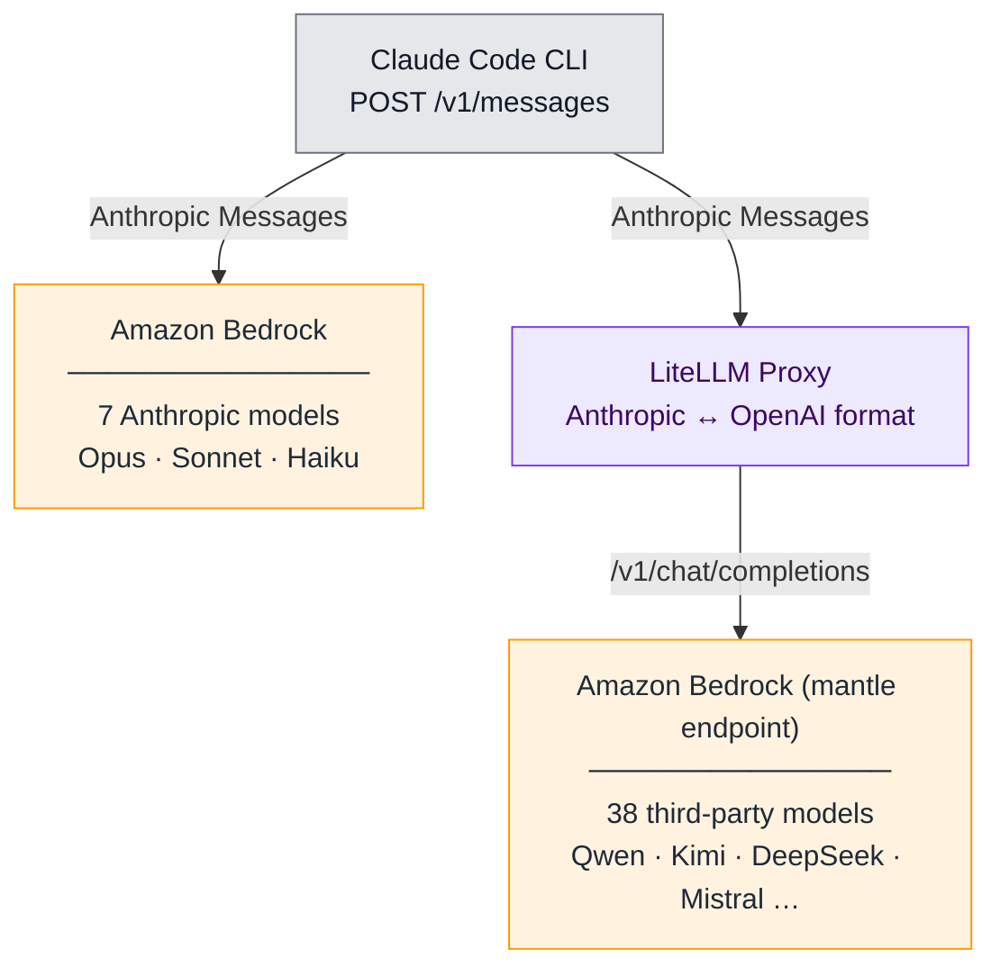

# Claude Code Multi-Model on Amazon Bedrock

[](../LICENSE)
[](https://docs.aws.amazon.com/bedrock/latest/userguide/models-endpoint-availability.html)
[](./)

> **This is sample code intended for demonstration and learning purposes only.**
> It is not meant for production use. Review and harden all scripts, configurations,
> and IAM permissions before using in any production or sensitive environment.

Run [Claude Code](https://docs.anthropic.com/en/docs/claude-code) with **any of 45
foundation models on Amazon Bedrock** — not just Anthropic models. A LiteLLM proxy
translates Claude Code's Anthropic Messages API to the OpenAI Chat Completions API
that the third-party models on Bedrock's OpenAI-compatible `bedrock-mantle`
endpoint speak, so you can route routine tasks to cheaper models and reserve
frontier models for complex work. Native Anthropic models run directly on
Bedrock with no proxy.

See the [HumanEval benchmark](#benchmark-humaneval) below for a quality comparison
across models.

## Architecture



**Why a proxy?** Claude Code speaks the Anthropic Messages API. Amazon
Bedrock supports three inference APIs on the `bedrock-mantle` endpoint —
[Anthropic Messages](https://docs.aws.amazon.com/bedrock/latest/userguide/inference-messages-api.html),
[OpenAI Chat Completions](https://docs.aws.amazon.com/bedrock/latest/userguide/inference-chat-completions-mantle.html),
and [OpenAI Responses](https://docs.aws.amazon.com/bedrock/latest/userguide/bedrock-mantle.html)
— but only **Claude/Anthropic models** are reachable through Messages.
Non-Anthropic models (Qwen, DeepSeek, Kimi, Mistral, etc.) are reachable
only through the OpenAI-compatible APIs. [LiteLLM](https://github.com/BerriAI/litellm)
sits between Claude Code and Bedrock, translating Anthropic Messages to
OpenAI Chat Completions for those non-Anthropic models.

**Why this endpoint?** `bedrock-mantle` is Amazon Bedrock's
[OpenAI-compatible endpoint](https://docs.aws.amazon.com/bedrock/latest/userguide/inference.html)
for non-Anthropic foundation models. It exposes Chat Completions and
Responses (the same shapes OpenAI's own SDKs use) and supports API-key auth
or AWS SigV4. All 38 third-party models on this endpoint support tool
calling and streaming natively — no per-model configuration needed.

## Supported Models (45 total)

> Pass the **raw Bedrock model ID** to `--model`. No aliases — what you type is what hits Bedrock.

### Anthropic (7 — native Bedrock, no proxy)

| Bedrock Model ID | Model | Best For |
|------------------|-------|----------|
| `us.anthropic.claude-opus-4-8` | Claude Opus 4.8 | Newest flagship |
| `us.anthropic.claude-opus-4-7` | Claude Opus 4.7 | Flagship |
| `us.anthropic.claude-opus-4-6-v1` | Claude Opus 4.6 | Flagship, strong reasoning |
| `us.anthropic.claude-sonnet-4-6` | Claude Sonnet 4.6 | Balanced speed/quality |
| `us.anthropic.claude-haiku-4-5-20251001-v1:0` | Claude Haiku 4.5 | Fast, lightweight tasks |
| `us.anthropic.claude-opus-4-5-20251101-v1:0` | Claude Opus 4.5 | Previous gen flagship |
| `us.anthropic.claude-sonnet-4-5-20250929-v1:0` | Claude Sonnet 4.5 | Previous gen balanced |

### Third-Party (38 — via LiteLLM proxy → Amazon Bedrock)

| Provider | Models | Bedrock Model IDs |
|----------|--------|-------------------|
| **Qwen** (7) | Coder Next, Coder 480B, Coder 30B, 235B, 32B, VL 235B, Next 80B | `qwen.qwen3-coder-next`, `qwen.qwen3-coder-480b-a35b-instruct`, `qwen.qwen3-coder-30b-a3b-instruct`, `qwen.qwen3-235b-a22b-2507`, `qwen.qwen3-32b`, `qwen.qwen3-vl-235b-a22b-instruct`, `qwen.qwen3-next-80b-a3b-instruct` |
| **DeepSeek** (2) | V3.2, V3.1 | `deepseek.v3.2`, `deepseek.v3.1` |
| **Mistral** (8) | Devstral 123B, Large 3 675B, Magistral Small, Ministral 14B/8B/3B, Voxtral Small/Mini | `mistral.devstral-2-123b`, `mistral.mistral-large-3-675b-instruct`, `mistral.magistral-small-2509`, `mistral.ministral-3-14b-instruct`, `mistral.ministral-3-8b-instruct`, `mistral.ministral-3-3b-instruct`, `mistral.voxtral-small-24b-2507`, `mistral.voxtral-mini-3b-2507` |
| **Moonshot AI** (2) | Kimi K2.5, K2 Thinking | `moonshotai.kimi-k2.5`, `moonshotai.kimi-k2-thinking` |
| **MiniMax** (3) | M2, M2.1, M2.5 | `minimax.minimax-m2`, `minimax.minimax-m2.1`, `minimax.minimax-m2.5` |
| **NVIDIA** (4) | Nemotron Super 120B, Nano 30B/12B/9B | `nvidia.nemotron-super-3-120b`, `nvidia.nemotron-nano-3-30b`, `nvidia.nemotron-nano-12b-v2`, `nvidia.nemotron-nano-9b-v2` |
| **OpenAI** (4) | GPT OSS 120B/20B, Safeguard 120B/20B | `openai.gpt-oss-120b`, `openai.gpt-oss-20b`, `openai.gpt-oss-safeguard-120b`, `openai.gpt-oss-safeguard-20b` |
| **Z.AI** (4) | GLM 5, 4.7, 4.7 Flash, 4.6 | `zai.glm-5`, `zai.glm-4.7`, `zai.glm-4.7-flash`, `zai.glm-4.6` |
| **Google** (3) | Gemma 3 27B/12B/4B | `google.gemma-3-27b-it`, `google.gemma-3-12b-it`, `google.gemma-3-4b-it` |
| **Writer** (1) | Palmyra Vision 7B | `writer.palmyra-vision-7b` |

> **Note:** Meta Llama, Amazon Nova, and DeepSeek R1 are available on Bedrock but **not** on the `bedrock-mantle` endpoint — they lack tool calling support required by Claude Code.

## Benchmark (HumanEval)

To compare model quality, we ran [HumanEval](https://github.com/openai/human-eval)
— OpenAI's 164-task code-generation benchmark — through Claude Code backed by
each model. Each task was driven by Claude Code (`claude -p`) and scored with the
standard `pass@1` method: the model's completion is concatenated with the task's
prompt preamble and unit tests, executed, and counted as a pass only if every
assertion holds.

| Model | Routing | pass@1 | Passed | Avg time/task | Input $/1M | Output $/1M |
| --- | --- | --- | --- | --- | --- | --- |
| Claude Sonnet 4.6 | native Bedrock | **97.6%** | 160/164 | 3.4s | $3.00 | $15.00 |
| Kimi K2.5 | proxy → Bedrock | 96.3% | 158/164 | 5.9s | $0.60 | $3.00 |
| DeepSeek V3.2 | proxy → Bedrock | 94.5% | 155/164 | 19.6s | $0.62 | $1.85 |
| Qwen Coder Next | proxy → Bedrock | 91.5% | 150/164 | 14.1s | $0.50 | $1.20 |
| Qwen Coder 30B | proxy → Bedrock | 90.9% | 149/164 | 9.5s | $0.15 | $0.62 |

All 164 tasks, single run per model. The budget models reach 93–99% of the
frontier model's pass rate on this benchmark. Remaining failures are genuine
incorrect solutions on HumanEval's harder tasks (e.g. /93, /127, /132, /145),
not harness artifacts.

> **Pricing source:** Per-1M-token rates are on-demand Standard-tier prices for
> US East (N. Virginia / Ohio) on the [Amazon Bedrock pricing page](https://aws.amazon.com/bedrock/pricing/),
> as published at the time of writing. Always check the page for current rates;
> Bedrock also offers Priority, Flex, and Batch tiers at different prices.
>
> **Sonnet versions:** The table uses **Claude Sonnet 4.6**
> (`us.anthropic.claude-sonnet-4-6`). For reference, Claude Code's *built-in*
> default Sonnet alias (no explicit `--model` flag) resolves to **Sonnet 4.5**
> and scored 99.4% (163/164) in a separate run — single-run pass@1 varies by
> a few tasks between versions and runs, so treat the two as comparable.

**Reproduce:**

```bash
cd benchmark
# Start the proxy first (for the non-Anthropic models)
../scripts/setup-proxy.sh
python3 humaneval_runner.py --models us.anthropic.claude-sonnet-4-6,qwen.qwen3-coder-30b-a3b-instruct,moonshotai.kimi-k2.5,qwen.qwen3-coder-next,deepseek.v3.2 --all
```

Raw results (per-task CSV + summary) are saved under `benchmark/results/`.

> **Security warning:** `humaneval_runner.py` executes model-generated Python
> directly on the host with `subprocess.run(["python3", path])`. There is a
> per-task timeout, but no filesystem, network, or environment-variable
> isolation. A malicious or buggy completion can read/write local files and
> reach any network endpoint your shell can reach. **Run this benchmark inside
> a disposable container or VM**, not on a machine with sensitive credentials
> or production access. If you need to harden it in-place, wrap the subprocess
> in `firejail`, `bwrap`, or `docker run --rm --network=none` and drop env
> vars before invocation.

**Source:** The benchmark tasks come directly from the public HumanEval dataset —
the [`openai/human-eval`](https://github.com/openai/human-eval) repository, loaded
via the [`openai_humaneval`](https://huggingface.co/datasets/openai/openai_humaneval)
dataset on Hugging Face. We did not modify the tasks; each was driven through
[Claude Code](https://github.com/anthropics/claude-code) and scored with the
standard `pass@1` method.

> **Caveat:** HumanEval measures single-function code generation, not multi-file
> agentic editing. It is a quality signal for routing decisions, not a complete
> evaluation of agent capability. Pair it with your own workload before choosing
> a model for production routing.

## Prerequisites

- **AWS Account** with Bedrock model access enabled
- **AWS CLI** configured (`aws configure` or IAM role/SSO)
- **Python 3.9+** (for LiteLLM proxy and token generation)
- **[uv](https://docs.astral.sh/uv/getting-started/installation/)** for Python dependency management
- **Claude Code CLI** installed ([docs](https://docs.anthropic.com/en/docs/claude-code))

## Quick Start

### 1. Clone and setup

```bash
git clone https://github.com/aws-samples/sample-claude-code-multi-model.git
cd sample-claude-code-multi-model/bedrock
chmod +x scripts/*.sh
```

### 2. Install Python dependencies with `uv`

If you don't already have `uv`, install it (one-line; full instructions in the
[uv docs](https://docs.astral.sh/uv/getting-started/installation/)):

```bash
curl -LsSf https://astral.sh/uv/install.sh | sh
```

Then create a virtual environment and install the proxy + benchmark dependencies
(`litellm[proxy]`, `aws-bedrock-token-generator`, `datasets`):

```bash
uv sync               # creates .venv/ and installs everything
source .venv/bin/activate
```

`uv sync` reads [pyproject.toml](pyproject.toml) and produces a reproducible
install. Activating the venv puts `litellm` on your `PATH` so the proxy script
can find it.

### 3. Use Anthropic models (no proxy needed)

```bash
./scripts/claude-model.sh --model us.anthropic.claude-opus-4-8
./scripts/claude-model.sh --model us.anthropic.claude-sonnet-4-6
./scripts/claude-model.sh --model us.anthropic.claude-haiku-4-5-20251001-v1:0
```

### 4. Use third-party models (proxy required)

```bash
# Step 1: Start the LiteLLM proxy (generates Bedrock token, installs deps)
./scripts/setup-proxy.sh

# Step 2: Run Claude Code with any model
./scripts/claude-model.sh --model qwen.qwen3-coder-next
./scripts/claude-model.sh --model deepseek.v3.2
./scripts/claude-model.sh --model moonshotai.kimi-k2.5
./scripts/claude-model.sh --model mistral.devstral-2-123b

# With a prompt
./scripts/claude-model.sh --model qwen.qwen3-coder-next -p "write a Python REST API"
```

### 5. Interactive model picker

```bash
./scripts/claude-model.sh
# Shows numbered list of all 45 models — pick one
```

### 6. List all available models

```bash
./scripts/claude-model.sh --list
```

## Proxy Management

```bash
# Start proxy (installs litellm + token generator if needed)
./scripts/setup-proxy.sh

# Custom port (default: 4000)
./scripts/setup-proxy.sh --port 8080

# Check status
./scripts/setup-proxy.sh --status

# Refresh Bedrock bearer token (valid 12h)
./scripts/setup-proxy.sh --refresh

# Stop proxy
./scripts/setup-proxy.sh --stop

# View logs
tail -f .litellm.log
```

### Bind address (`--host`)

By default the proxy binds to **`127.0.0.1`** — Claude Code on the same machine
can reach it, nothing else can. The proxy does not authenticate its own clients
(the only auth gate is the Bedrock bearer token it uses upstream), so leaving
the default in place is the safe choice.

If you need clients on other hosts to reach the proxy (e.g. Claude Code running
in a different VM in the same VPC, or a containerized client using a separate
network namespace), override the bind:

```bash
# Bind to a specific private IP — only that interface accepts connections
./scripts/setup-proxy.sh --host 10.0.1.42

# Bind to all interfaces — careful, see warning below
./scripts/setup-proxy.sh --host 0.0.0.0
```

When `--host` is anything other than `127.0.0.1` / `localhost` the script prints
a warning. Treat the security-group / firewall layer as the only thing standing
between the proxy and the outside world, and:

- restrict ingress to port 4000 (or whatever `--port` you used) to known source CIDRs
- prefer a private IP over `0.0.0.0` so the proxy only listens on the interface that needs it
- run on a private subnet rather than something with a public IP attached

## Manual Configuration (No Scripts)

### Anthropic models (native Bedrock)

```bash
export CLAUDE_CODE_USE_BEDROCK=1
export AWS_REGION=us-east-1
claude
```

### Third-party models (via proxy)

```bash
# Terminal 1: Start proxy
pip install "litellm[proxy]" aws-bedrock-token-generator
eval $(./scripts/mantle-token.sh)
LITELLM_USE_CHAT_COMPLETIONS_URL_FOR_ANTHROPIC_MESSAGES=true \
  litellm --config config/litellm-config.yaml --port 4000

# Terminal 2: Run Claude Code
ANTHROPIC_BASE_URL=http://localhost:4000 \
ANTHROPIC_API_KEY=bedrock-proxy \
claude --settings config/claude-proxy-settings.json \
       --model qwen.qwen3-coder-next
```

> **Important:** The `--settings config/claude-proxy-settings.json` flag disables Bedrock native mode (`CLAUDE_CODE_USE_BEDROCK=0`) so Claude Code routes through the proxy instead. Without it, Claude Code may try to connect directly to Bedrock and fail for non-Anthropic model IDs.

## Shell Aliases (Optional)

Add to `~/.zshrc` or `~/.bashrc`:

```bash
# Native Bedrock models — pin a specific Anthropic Bedrock model ID
alias cc-opus='CLAUDE_CODE_USE_BEDROCK=1 AWS_REGION=us-east-1 ANTHROPIC_MODEL=us.anthropic.claude-opus-4-6-v1 claude'
alias cc-sonnet='CLAUDE_CODE_USE_BEDROCK=1 AWS_REGION=us-east-1 ANTHROPIC_MODEL=us.anthropic.claude-sonnet-4-6 claude'

# Proxy models (requires LiteLLM running on :4000)
CC_PROXY="ANTHROPIC_BASE_URL=http://localhost:4000 ANTHROPIC_API_KEY=bedrock-proxy"
alias cc-qwen="$CC_PROXY claude --settings ~/sample-claude-code-multi-model/bedrock/config/claude-proxy-settings.json --model qwen.qwen3-coder-next"
alias cc-deepseek="$CC_PROXY claude --settings ~/sample-claude-code-multi-model/bedrock/config/claude-proxy-settings.json --model deepseek.v3.2"
alias cc-devstral="$CC_PROXY claude --settings ~/sample-claude-code-multi-model/bedrock/config/claude-proxy-settings.json --model mistral.devstral-2-123b"
alias cc-kimi="$CC_PROXY claude --settings ~/sample-claude-code-multi-model/bedrock/config/claude-proxy-settings.json --model moonshotai.kimi-k2.5"
```

## What's Inside

| File | What it does |
| --- | --- |
| [scripts/setup-proxy.sh](scripts/setup-proxy.sh) | One-command proxy setup: generates Bedrock token, installs LiteLLM, starts proxy |
| [scripts/claude-model.sh](scripts/claude-model.sh) | Interactive model picker / launcher for all 45 models |
| [scripts/mantle-token.sh](scripts/mantle-token.sh) | Standalone Bedrock bearer token generator (12h validity) |
| [config/litellm-config.yaml](config/litellm-config.yaml) | LiteLLM proxy config with all 38 models |
| [config/claude-proxy-settings.json](config/claude-proxy-settings.json) | Claude Code settings override (disables native Bedrock mode) |

## How It Works

1. **Token generation**: `setup-proxy.sh` generates a bearer token from your AWS IAM credentials using `aws-bedrock-token-generator`. Tokens are scoped to `us-east-1` and valid for 12 hours.

2. **LiteLLM translation**: The proxy receives Anthropic Messages API requests from Claude Code and translates them to OpenAI Chat Completions format for the `bedrock-mantle` endpoint.

3. **`bedrock-mantle` endpoint**: Amazon Bedrock's [OpenAI-compatible endpoint](https://docs.aws.amazon.com/bedrock/latest/userguide/inference.html) (`bedrock-mantle.us-east-1.api.aws`) routes requests to the selected model. All 38 non-Anthropic models support tool calling and streaming.

4. **Key env var**: `LITELLM_USE_CHAT_COMPLETIONS_URL_FOR_ANTHROPIC_MESSAGES=true` forces LiteLLM to use `/v1/chat/completions` (not `/v1/responses`) — required for `bedrock-mantle` compatibility with LiteLLM v1.83+.

## Limitations

- **Context window**: Third-party models have smaller context windows (128K or less) compared to Claude's 200K. Claude Code's system prompt is large (~100K chars), so very small models may not work well.
- **Tool calling quality**: Claude Code relies heavily on structured tool use. Non-Anthropic models vary in tool-calling reliability.
- **Prompt caching**: Disabled for proxy models (not supported across the translation layer).
- **Region**: Amazon Bedrock is currently only available in `us-east-1`.
- **Token expiry**: Bedrock bearer tokens expire after 12 hours. Use `./scripts/setup-proxy.sh --refresh` to regenerate.

## Troubleshooting

| Issue | Fix |
|-------|-----|
| `Proxy not reachable` | Run `./scripts/setup-proxy.sh` |
| `AccessDeniedException` | Enable model access in [Bedrock console](https://console.aws.amazon.com/bedrock/home#/modelaccess) |
| `AWS credentials not configured` | Run `aws configure` or set up IAM role/SSO |
| `The provided model identifier is invalid` | Make sure you're using `--settings config/claude-proxy-settings.json` (disables native Bedrock mode) |
| `Token expired` | Run `./scripts/setup-proxy.sh --refresh` then restart proxy |
| Small model fails with Claude Code | Claude Code's system prompt is ~100K chars — models with <128K context may fail |

## See Also

- **[Claude Code on Amazon EC2](../self-hosted/README.md)** — Run Claude Code backed by a self-hosted open-source model (Ollama + Qwen 3.5) on an EC2 GPU instance. Fixed hourly cost, data stays in your VPC.

## License

This library is licensed under the MIT-0 License. See the [LICENSE](../LICENSE) file.
